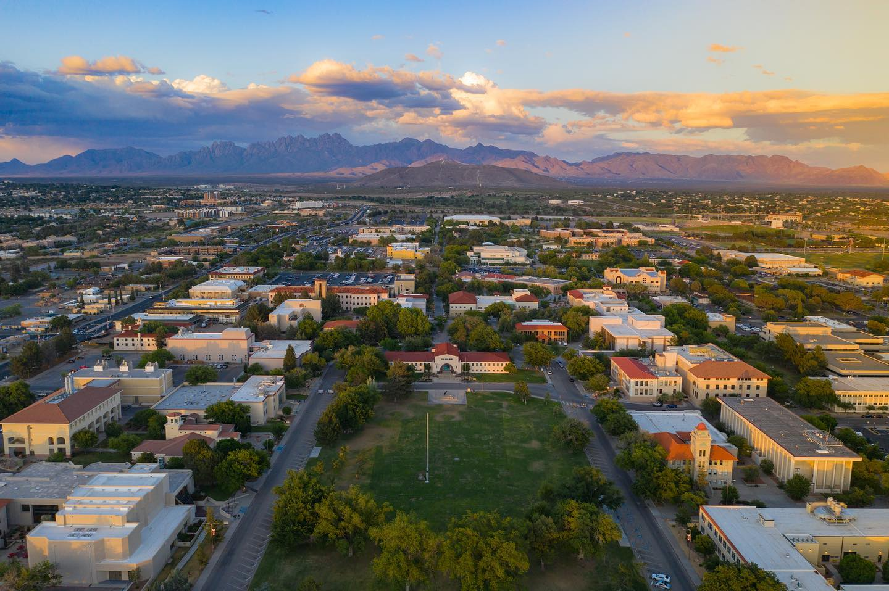

# Spring2022NMSU

Hello there future person! Not sure why you are browsing this git directory but I hope it helps you with your studies!

This is my github dir with my homework, notes, and labs from New Mexico State University Fall 2022. 

## CONTEXT

**New Mexico State University** (**NMSU** or **NM State**) is a [public](https://en.wikipedia.org/wiki/Public_university_system "Public university system") [land-grant](https://en.wikipedia.org/wiki/Land-grant_university "Land-grant university") [research university](https://en.wikipedia.org/wiki/Research_university "Research university") with its main campus in [Las Cruces, New Mexico](https://en.wikipedia.org/wiki/Las_Cruces,_New_Mexico "Las Cruces, New Mexico"), in the [United States](https://en.wikipedia.org/wiki/United_States "United States").[1]([New Mexico State University - Wikipedia](https://en.wikipedia.org/wiki/New_Mexico_State_University))

## CLASSES

The classes I am taking this year are: 

- CS370
  
  - COMPILERS & AUTOMATA

- EE317
  
  - Semiconductor Devices and Electronics I

- CS488
  
  - Introduction to Data Mining

- EE512
  
  - Computer Architecture

Goodluck and please leave comments on things I messed up so both you and I can learn from that.

## AUTHOR

Jason Ivey is a senior C.S. & E.E. student at New Mexico State University. He was a principal C++ developer for the Nano-Sat lab's first space mission and is currently helping design future missions involving embedded image processing.

### 

### WHY?

This repo exists so that future students can benefit from my mistakes and so that it is an open resource to people seeking a non-tradition education.

Goodluck and please leave comments on things I messed up so both you and I can learn from that.
